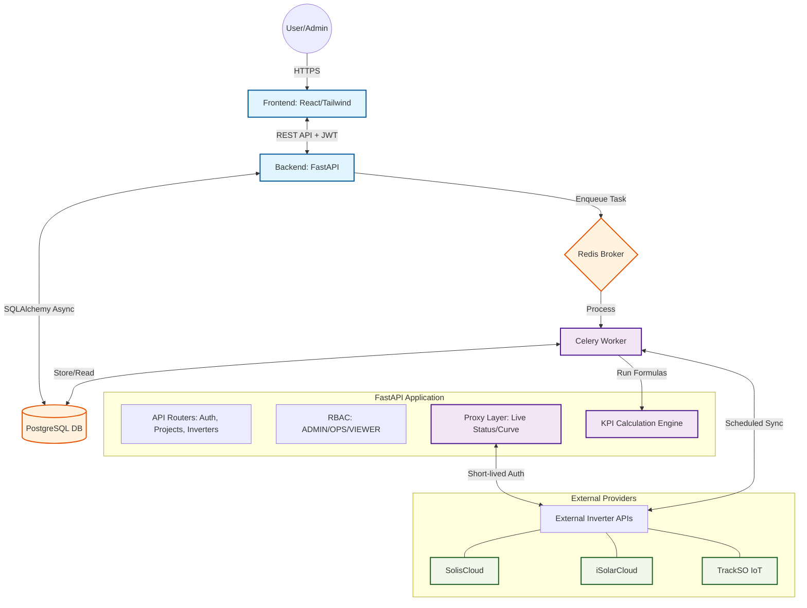

# Talf Solar MIS: System Architecture

This diagram illustrates the flow of data and control between the core components of the system.

---

## Component Breakdown

### 1. Frontend (React/Tailwind)
- **Roles**: Dashboard visualization, data entry forms, and user management.
- **Auth**: Manages JWT tokens for session persistence.

### 2. Backend (FastAPI)
- **Roles**: Exposes REST endpoints, validates schemas (Pydantic), and enforces Role-Based Access Control.
- **Proxy**: Bypasses CORS and securely injects encrypted vendor credentials for real-time status.

### 3. Database (PostgreSQL)
- **Roles**: Long-term storage of project metadata, encrypted API keys, manual energy entries, and pre-calculated KPIs.

### 4. Task Queue (Redis + Celery)
- **Roles**: Handles time-consuming operations (like fetching 12 months of historical data) off the main request-response cycle to keep the UI responsive.
- **Scheduler**: Triggers the **02:00 IST** nightly sync.

### 5. External APIs
- **Roles**: Third-party sources for raw solar yield. The system acts as a standardizing middleware for these disparate data sources.
