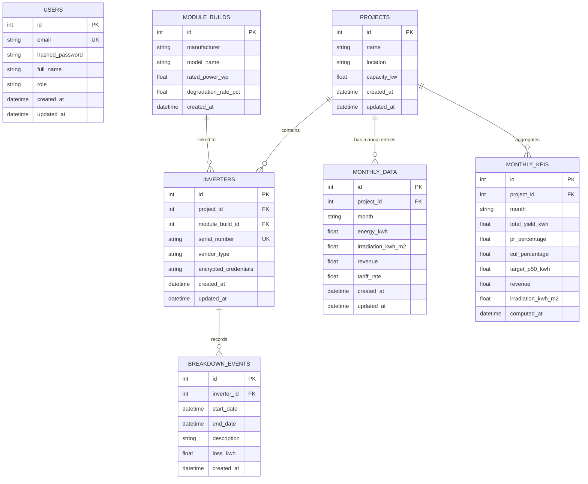

# Database Schema Design

This document details the relational database schema for the Talf Solar Management Information System.

## Entity Relationship Diagram

## Entity Details

### Users
Stores administrative and operational user accounts. Roles include ADMIN, OPERATIONS, and VIEWER to enforce access control.

### Projects
The top-level entity representing a solar installation. It acts as a container for inverters and aggregated performance data.

### Inverters
Represents individual solar inverters. Holds encrypted credentials for third-party API communication (SolisCloud, Sungrow, etc.) and is linked to a specific project.

### Module Builds
Templates for solar panel configurations. These define technical specifications like degradation rates, which are essential for calculating theoretical energy targets.

### Monthly Data
Stores manual data entries or bulk-uploaded CSV records for a project's monthly performance (energy, irradiation, and revenue).

### Monthly KPIs
Stores pre-calculated Performance Ratio (PR), Capacity Utilisation Factor (CUF), and P50 targets. This table ensures fast dashboard loading by avoiding on-the-fly complex calculations.

### Breakdown Events
Logs downtime or fault occurrences for specific inverters, including estimated energy loss and maintenance descriptions.